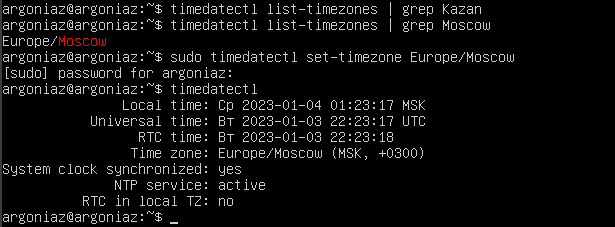
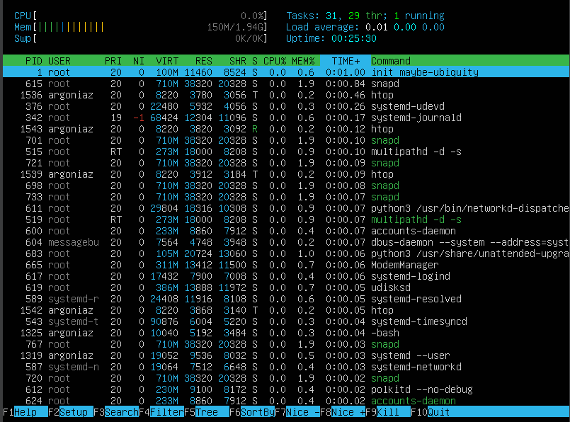
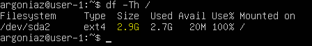
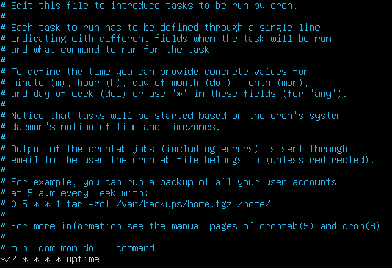

# Report


## Part 1. Установка ОС

- Установить Ubuntu 20.04 Server LTS без графического интерфейса. (Используем программу для виртуализации - VirtualBox)


```bash
cat /etc/issue
```

## Part 2. Создание пользователя

- Создать пользователя, отличного от пользователя, который создавался при установке. Пользователь должен быть добавлен в группу `adm`


```bash
sudo adduser timyr
cat /etc/passwd
sudo usermod -aG adm timyr
members adm
```

## Part 3. Настройка сети ОС

- Задать название машины вида user-1 

 

```bash
hostnamectl
hostnamectl set-hostname user-1
hostnamectl
```

- Установить временную зону, соответствующую вашему текущему местоположению.



```bash
timedatectl list-timezones | grep Kazan
timedatectl list-timezones | grep Moscow
sudo timedatectl set-timezone Europe/Moscow
timedatectl
```  

- Вывести названия сетевых интерфейсов с помощью консольной команды.


```bash
ip -s link
``` 

Интерфейс lo (loopback) - виртуальный интерфейс, присутствующий по умолчанию в любом Linux. lo используется для того, чтобы компьютер мог обращаться к самому себе и имеет по умолчанию ip-адрес 127.0.0.1 на всех компьютерах.

- Используя консольную команду получить ip адрес устройства, на котором вы работаете, от DHCP сервера. 


```bash
ip route
``` 

DHCP - Dynamic Host Configuration Protocol - протокол, использующийся для автоматического выставления различной конфигурации, в том числе IP-адресов.

- Определить и вывести на экран внешний ip-адрес шлюза (ip) и внутренний IP-адрес шлюза, он же ip-адрес по умолчанию (gw). 

 

Внешний

 

Внутренний

```bash
wget -O - -q icanhazip.com
ip route show | grep default
```


- Задать статичные (заданные вручную, а не полученные от DHCP сервера) настройки ip, gw, dns (использовать публичный DNS серверы, например 1.1.1.1 или 8.8.8.8).  


```bash
sudo vim /etc/netplan/00-installer-config.yalm
sudo netplan apply
```
- Перезагрузить виртуальную машину. Убедиться, что статичные сетевые настройки (ip, gw, dns) соответствуют заданным в предыдущем пункте.  


```bash
sudo shutdown -r now
ip a | grep "global enp0s3"
systemd-resolve --status | grep "DNS Servers"
ping 1.1.1.1
ping ya.ru
```

## Part 4. Обновление ОС

- Обновить системные пакеты до последней на момент выполнения задания версии.  


```bash
sudo apt update
```

## Part 5. Использование команды **sudo**

- Разрешить пользователю, созданному в Part 2, выполнять команду sudo.


```bash
sudo usermod -aG sudo timyr
hostname
su timyr
sudo hostnamectl set-hostname user-2
hostname
```

`sudo` — консольная команда выполняющая команду переданную ей как аргумент с правами суперпользователя (root). Запуск команды, которая создаёт файлы и директории из-под sudo, приводит к тому, что владельцем этих файлов становится пользователь root. Фактически все последующие обращения к этому файлу без sudo начнут выдавать ошибку об отсутствии прав доступа. 

## Part 6. Установка и настройка службы времени

- Настроить службу автоматической синхронизации времени.  


```bash
timedatectl show
```

## Part 7. Установка и использование текстовых редакторов 

- Установить текстовые редакторы **VIM** (+ любые два по желанию **NANO**, **MCEDIT**, **JOE** и т.д.)


```bash
sudo apt install nano
sudo apt install vim
sudo apt install mcedit
```

- Используя каждый из трех выбранных редакторов, создайте файл *test_X.txt*, где X -- название редактора, в котором создан файл. Напишите в нём свой никнейм, закройте файл с сохранением изменений.


```bash
touch test_vim.txt
vim test_vim.txt
```

vim: `escape` + `:` + `w` + `q` + `enter` - для выхода и сохранения изменений


```bash
touch test_nano.txt
nano test_nano.txt
```

nano: `ctrl` + `x` + `y` + `enter` - для выхода и сохранения изменений


```bash
touch test_mcedit.txt
mcedit test_mcedit.txt
```

mcedit: `F2` + `enter` + `F10` - для выхода и сохранения изменений

- Используя каждый из трех выбранных редакторов, откройте файл на редактирование, отредактируйте файл, заменив никнейм на строку "21 School 21", закройте файл без сохранения изменений.


```bash
vim test_vim.txt
```
vim: `escape` + `:` + `!` + `q` + `enter` - для выхода без сохранения


```bash
nano test_nano.txt
```

nano: `ctrl` + `x` + `n` - для выхода без сохранения


```bash
mcedit test_mcedit.txt
```

mcedit: `F10` + `No` - для выхода без сохранения

- Используя каждый из трех выбранных редакторов, отредактируйте файл ещё раз (по аналогии с предыдущим пунктом), а затем освойте функции поиска по содержимому файла (слово) и замены слова на любое другое.


```bash
vim test_vim.txt
```

vim: `escape` + `/` + `target` - для поиска слова

vim: `escape` + `%` + `s` + `target` + `/` + `replace target` + `enter` - для замены слова    


```bash
nano test_nano.txt
```
nano: `ctrl` + `w` + `target` + `enter` - для поиска слова

nano: `ctrl` + `/` + `target` + `enter` + `replace target` + `enter` + `y` - для замены слова   


```bash
mcedit test_mcedit.txt
```

mcedit: `F7` + `target` + `Ok` + `enter` - для поиска слова

mcedit: `F4` + `target` + `replace target` + `Ok` + `enter` - для замены слова   

## Part 8. Установка и базовая настройка сервиса **SSHD**

- Установить службу SSHd.


```bash
sudo apt-get install openssh-server
```

- Добавить автостарт службы при загрузке системы.  


```bash
sudo systemctl enable ssh
```


```bash
systemctl list-unit-files --type=service --state=enabled
```

- Перенастроить службу SSHd на порт 2022.


```bash
sudo nano /etc/ssh/sshd_config
```

- Используя команду ps, показать наличие процесса sshd. Для этого к команде нужно подобрать ключи.


```bash
ps -aux | grep sshd
```

`--output--`

`UID` - польтзователь, от имени которого запущен процесс
`PID` - инденфикатор процесса
`PPID` - индентификатор родительского процесса
`C` - процент времени CPU, используемое процессом
`SZ` - размера процесса в памяти
`RSS` - реальный размер процесса в памяти
`PSR` - ядро процессора, на котором выполняется процесс
`STIME` - время запуска процесса
`TTY` - терминал, из которого запущен процесс
`TIME` - общее время процессора, затраченного на выполнение процесса
`CMD` - команда запуска процесса

`--input--`

`ps`выводит список текущих процессов на сервере
`a` выбрать все процессы, кроме фоновых.
`u` выбрать процессы пользователя.
`x` выводит список всех процессов, принадлежащих вам (тот же EUID, что и ps), или выводит список всех процессов при использовании вместе с опцией `a`

- Перезагрузить систему.


```bash
sudo shutdown -r now
netstat -tan
```

`--output--`

`Proto` - протокол используемый сокетом
`Recv-Q` - количество байтов не переданных пользователем
`Send-Q` - количество байтов не подтвержденных удаленным хостом
`Local Address` - локальный адрес и номер порта локальной сети
`Foreign Address` - локальный адрес и номер порта удаленной сети
`State` - состояние сокета
`0.0.0.0` означает, что подключение может быть выполнено с/на любой адрес
`LISTEN` готовность к установке соединения

`--input--`

`netstat` утилита командной строки, выводящая на дисплей состояние TCP-соединений
`a` отображает все активные соединения и порты TCP и UDP, через которые прослушивается компьютер.
`n` отображает активные TCP-соединения, однако адреса и номера портов выражаются численно, и не предпринимается никаких попыток определить имена.
`t` отображает только TCP-соединения.

## Part 9. Установка и использование утилит **top**, **htop**

- Установить и запустить утилиты top и htop.


```bash
sudo apt install top
sudo apt install htop
top
htop
```

- uptime


```bash
top
```

- количество авторизованных пользователей


```bash
top
```

- общую загрузку системы


```bash
top
```
- общее количество процессов


```bash
top
```

- загрузку cpu


```bash
top
```

- загрузку памяти


```bash
top
```

- pid процесса занимающего больше всего памяти


```bash
top
```

- pid процесса, занимающего больше всего процессорного времени


```bash
top
```

- отсортированному по PID, PERCENT_CPU, PERCENT_MEM, TIME


`PID`

`PERCENT_CPU`

`PERCENT_MEM`

`TIME`

```bash
htop
```

- отфильтрованному для процесса sshd


```bash
htop
```

- с процессом syslog, найденным, используя поиск


```bash
htop
```

- с добавленным выводом hostname, clock и uptime


```bash
htop
```

## Part 10. Использование утилиты **fdisk**

- Запустить команду fdisk -l.


```bash
fdisk -l
free -h
```

Название: `/dev/sda`
Размер: `4.15Gib`
Количество секторов: `8687304`
Размер swap: `0`

## Part 11. Использование утилиты **df** 

- Запустить команду df.  


```bash
df
```

- размер раздела


```bash
df /
```

- размер занятого пространства


```bash
df /
```

- размер свободного пространства


```bash
df /
```

- процент использования


```bash
df /
```

- Определить и написать в отчёт единицу измерения в выводе. 


Единица измерения: `Kb`

```bash
df /
```

- Запустить команду df -Th.


```bash
df -Th
```

- размер раздела



```bash
df -Th /
```

- размер занятого пространства


```bash
df -Th /
```

- размер свободного пространства


```bash
df -Th /
```

- процент использования


```bash
df -Th /
```

- Определить и написать в отчёт тип файловой системы для раздела.


```bash
df -Th /
```

Тип файловой системы для раздела: `ext4`

## Part 12. Использование утилиты **du**

- Запустить команду du.


```bash
du
```

- Вывести размер папок /home, /var, /var/log (в байтах, в человекочитаемом виде)


```bash
sudo du -sh -b /home
sudo du -sh -b /var
sudo du -sh -b /var/log
```

- Вывести размер всего содержимого в /var/log (не общее, а каждого вложенного элемента, используя *)


```bash
sudo du -sh -b * /var/log
```

## Part 13. Установка и использование утилиты **ncdu**

- Установить утилиту ncdu.


```bash
sudo apt install ncdu
ncdu
```

- Вывести размер папок /home, /var, /var/log.


```bash
sudo apt install ncdu
ncdu
```


`home`

```bash
sudo apt install ncdu
ncdu
```


`var`

```bash
sudo apt install ncdu
ncdu
```


`var/log`

```bash
sudo apt install ncdu
ncdu
```

## Part 14. Работа с системными журналами

- Открыть для просмотра `/var/log/dmesg`


```bash
cat /var/log/dmesg
```

- Открыть для просмотра `/var/log/syslog`


```bash
cat /var/log/syslog
```

- Открыть для просмотра `/var/log/auth.log`


```bash
cat /var/log/auth.log
```


```bash
cat /var/log/auth.log
```
`time: 00:36:58`
`user: argoniaz`
`method: LOGIN`


```bash
sudo systemctl restart ssh
```


```bash
cat /var/log/syslog
```

## Part 15. Использование планировщика заданий **CRON**

- Используя планировщик заданий, запустите команду uptime через каждые 2 минуты.




```bash
crontab -e
```


```bash
cat /var/log/syslog
```

- Удалите все задания из планировщика заданий.


```bash
crontab -l
crontab -r
crontab -l
```


